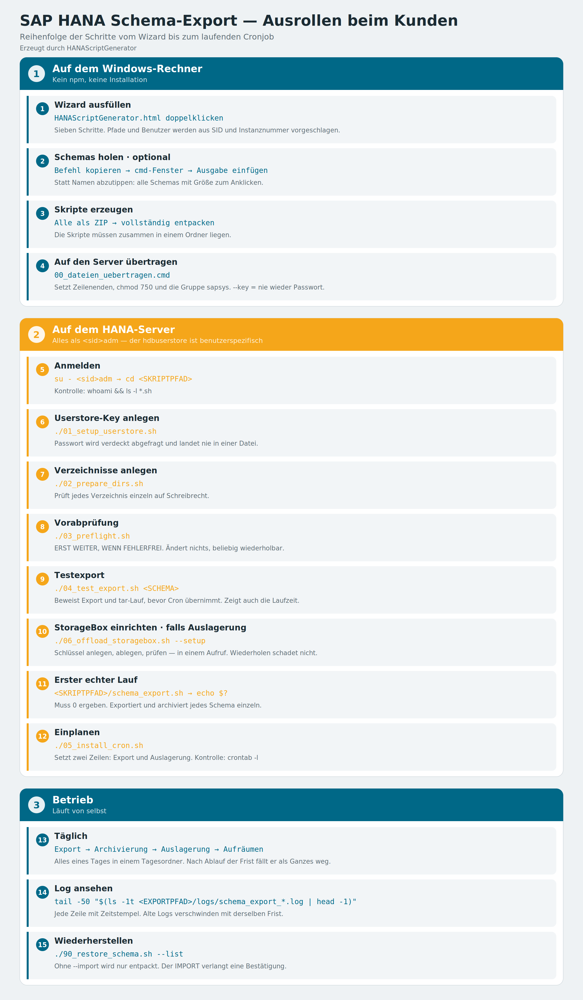

# Ausrollen beim Kunden — Schritt für Schritt

Reihenfolge und Befehle für einen kompletten Durchgang: vom Ausfüllen des
Wizards bis zum laufenden Cronjob.

Als Übersicht auf einer Seite: [`ablauf.svg`](ablauf.svg) — dieselbe Grafik
auch als [`ablauf.png`](ablauf.png) zum Einfügen in andere Dokumente.



Platzhalter in diesem Text:

| Platzhalter | Beispiel | Woher |
| --- | --- | --- |
| `<SID>` | `NDB` | SAP-SID des Tenants |
| `<sid>adm` | `ndbadm` | Instanzbenutzer, aus der SID abgeleitet |
| `<SKRIPTPFAD>` | `/usr/sap/NDB/HDB00/work` | Verzeichnis aus Schritt 2 des Wizards |
| `<SCHEMA>` | `MARIPROJECT` | eines der gesicherten Schemas |

---

## Teil 1 — Auf dem Windows-Rechner

### 1. Wizard ausfüllen

`HANAScriptGenerator.html` doppelklicken. Kein npm, keine Installation.

Sieben Schritte: System, Pfade, Schemas, Archivierung, Zeitplan,
Benachrichtigung, StorageBox. Pfade und Benutzer schlägt der Wizard aus SID und
Instanznummer vor — überschreiben, wo die Installation abweicht.

Oben rechts steht der Stand des Builds. Dieselbe Angabe landet im Kopf jedes
erzeugten Skripts; damit lässt sich später prüfen, womit gearbeitet wurde.

### 2. Schemas aus der Datenbank holen (optional)

Statt Namen abzutippen, im Schritt *Schemas* auf **Befehl kopieren**. Dann ein
`cmd`-Fenster öffnen, einfügen, ausführen:

```bash
hdbsql -n <HOST>:30015 -u SYSTEM "SELECT ..."
```

hdbsql fragt das Passwort selbst ab. Die Ausgabe markieren, kopieren und im
Wizard unten in *Ausgabe von hdbsql hier einfügen* einsetzen. Alle Schemas
erscheinen dann mit Tabellenzahl und Größe zum Anklicken.

### 3. Skripte erzeugen

Letzter Schritt des Wizards, Schaltfläche **Alle als ZIP**. Das ZIP vollständig
entpacken — die Skripte müssen zusammen in einem Ordner liegen.

### 4. Auf den Server übertragen

```bash
00_dateien_uebertragen.cmd
```

Überträgt alles per `scp`, setzt Zeilenenden, `chmod 750` und die Gruppe
`sapsys`. Das Passwort von `<sid>adm` wird einmal abgefragt.

Wer das nicht jedes Mal tippen will, richtet einmalig einen Schlüssel ein:

```bash
00_dateien_uebertragen.cmd --key
```

---

## Teil 2 — Auf dem HANA-Server

**Alle folgenden Schritte laufen als `<sid>adm`.** Der hdbuserstore ist
benutzerspezifisch: Key und Cronjob müssen unter demselben Benutzer liegen.

### 5. Anmelden

```bash
su - <sid>adm
```

```bash
cd <SKRIPTPFAD>
```

Kontrolle:

```bash
whoami && ls -l *.sh
```

Erwartet wird `<sid>adm` und `-rwxr-x---` bei allen Skripten.

### 6. Userstore-Key anlegen

```bash
./01_setup_userstore.sh
```

Fragt das Passwort des Datenbankbenutzers verdeckt ab und legt es im
hdbuserstore ab. Es landet weder im Skript noch in der Crontab.

### 7. Verzeichnisse anlegen

```bash
./02_prepare_dirs.sh
```

Legt Export-, Log- und Vermerkverzeichnis an und prüft jedes einzeln auf
Schreibrecht.

### 8. Vorabprüfung

```bash
./03_preflight.sh
```

Prüft Client, Verbindung, Schemas, Werkzeuge und Speicherplatz. Ändert nichts
und lässt sich beliebig wiederholen.

**Erst weitermachen, wenn dieser Lauf ohne Fehler durchgeht.** Ein fehlender
StorageBox-Schlüssel ist an dieser Stelle nur ein Hinweis — der entsteht in
Schritt 10.

### 9. Testexport

```bash
./04_test_export.sh <SCHEMA>
```

Exportiert ein Schema in ein Testverzeichnis und archiviert es. Damit sind
Export **und** tar-Lauf bewiesen, bevor Cron übernimmt. Bei großen Schemas gibt
der Lauf zusätzlich ein Gefühl für die spätere Laufzeit.

Der Lauf endet von selbst und räumt auf. Zum Liegenlassen: `--keep`.

### 10. StorageBox einrichten

*Nur wenn im Wizard die Auslagerung eingeschaltet wurde.*

```bash
./06_offload_storagebox.sh --setup
```

Legt das Schlüsselpaar an, hinterlegt den öffentlichen Teil auf der Box und
prüft die Anmeldung. Das Passwort der Box wird zweimal gebraucht: einmal zum
Holen vorhandener Schlüssel, einmal zum Schreiben.

Vorhandene Schlüssel bleiben erhalten. Der Aufruf lässt sich gefahrlos
wiederholen — steht die Anmeldung schon, meldet er das und rührt nichts an.

Danach prüfen:

```bash
./06_offload_storagebox.sh --check
```

### 11. Erster echter Lauf

```bash
<SKRIPTPFAD>/schema_export.sh
```

```bash
echo $?
```

Muss `0` sein. Der Lauf exportiert jedes Schema einzeln, archiviert jedes
einzeln und lagert anschließend aus.

Kontrolle:

```bash
ls -l <EXPORTPFAD>/$(date +%Y-%m-%d)
```

### 12. Einplanen

```bash
./05_install_cron.sh
```

Sichert eine bestehende Crontab und setzt zwei Zeilen: den Export und die
Auslagerung. Kontrolle:

```bash
crontab -l
```

Entfernen jederzeit mit `./05_install_cron.sh --remove`.

---

## Teil 3 — Betrieb

### Was täglich passiert

Zur eingestellten Zeit läuft der Export, danach die Auslagerung. Alles eines
Tages liegt in einem Tagesordner:

```
<EXPORTPFAD>/
├── 2026-01-15/
│   ├── <SCHEMA>_2026-01-15.tar.gz
│   └── ...
├── .offloaded/      Vermerk, welcher Tag übertragen ist
└── logs/
```

Nach Ablauf der Aufbewahrung fällt je ein ganzer Tagesordner weg.

### Log ansehen

```bash
tail -50 "$(ls -1t <EXPORTPFAD>/logs/schema_export_*.log | head -1)"
```

Nach Fehlern suchen:

```bash
grep -i "fehler\|error" "$(ls -1t <EXPORTPFAD>/logs/schema_export_*.log | head -1)"
```

### Wiederherstellen

```bash
./90_restore_schema.sh --list
```

```bash
./90_restore_schema.sh <SCHEMA> JJJJ-MM-TT
```

Entpackt nur. Erst mit `--import` wird zurückgespielt — das überschreibt
Produktivdaten und verlangt deshalb eine Bestätigung.

### Liegengebliebenes nachholen

```bash
./06_offload_storagebox.sh --pending
```

Überträgt alle Tage, die noch keinen Vermerk haben — etwa nach einer Nacht ohne
Netz. Der Cronjob macht das ohnehin täglich.

---

## Wenn etwas klemmt

| Symptom | Ursache | Abhilfe |
| --- | --- | --- |
| Cronjob läuft nie, manuell klappt es | Skript gehört `root` | `chown <sid>adm:sapsys <SKRIPTPFAD>/schema_export.sh` |
| `Permission denied` beim Aufruf | Ausführungsrecht fehlt | `chmod 750 *.sh` |
| `bad interpreter: ^M` | Windows-Zeilenenden | `sed -i 's/\r$//' *.sh` |
| `tee: ... Keine Berechtigung` | Verzeichnisse gehören `root` | `chown -R <sid>adm:sapsys <EXPORTPFAD>` |
| Anmeldung an der Box scheitert | `/home/.ssh` fehlt auf der Box | `./06_offload_storagebox.sh --setup` |
| hdbsql nicht gefunden | anderer Clientpfad | `which hdbsql`, Wert für `HDBSQL` anpassen |
| Skript bricht wortlos ab | `~/.sapenv.sh` enthält ein `exit` | behoben; Stand im Skriptkopf prüfen |

### Stand prüfen

```bash
head -30 <SKRIPTPFAD>/schema_export.sh | grep Stand
```

Weicht das von der Anzeige im Generator ab, wurde mit einer älteren Fassung
gearbeitet.
